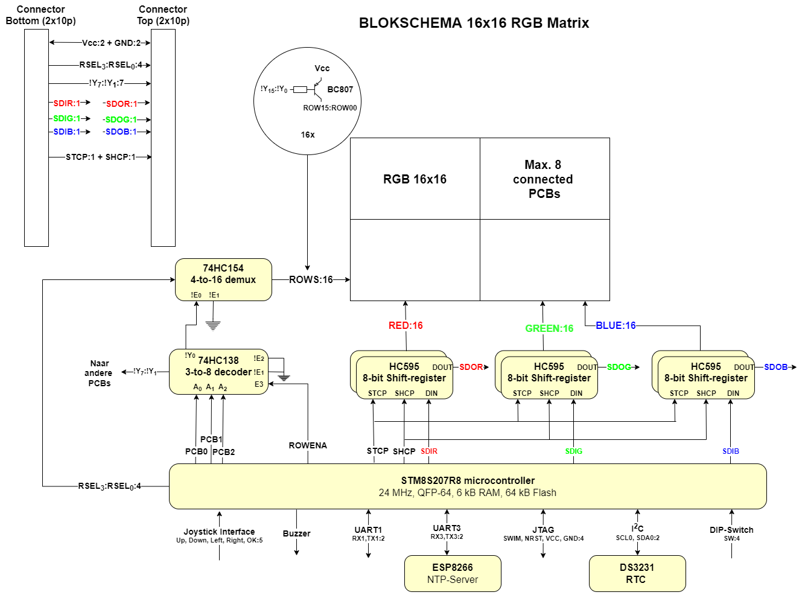
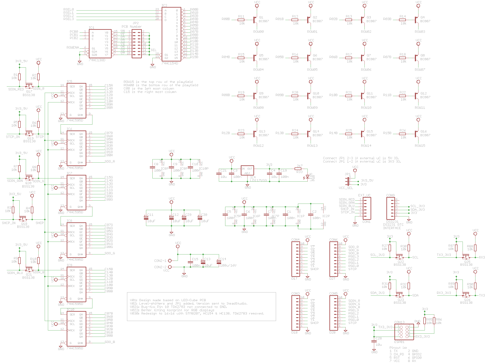
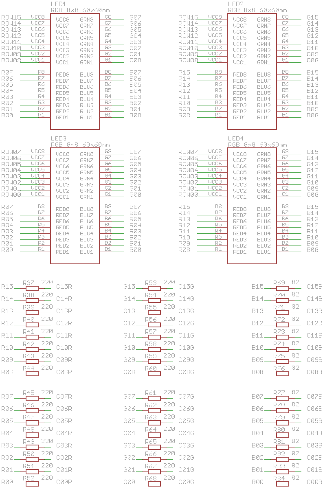

# RGB_Platform_STM8s207
RGB Platform with new hardware (4 x RGB 8x8 + STM8S207 uC)

# Software Development Environment
Use with IAR-STM8.

# Block-diagram
 
*Block diagram for RGB 8x8 PCB v0.3*

# Schematics
 
*Eagle schema: Digital IO*

 
*Eagle schema: RGB Matrix 4 x (8 x 8)*

 
*Eagle schema: STM8S207 uC*

